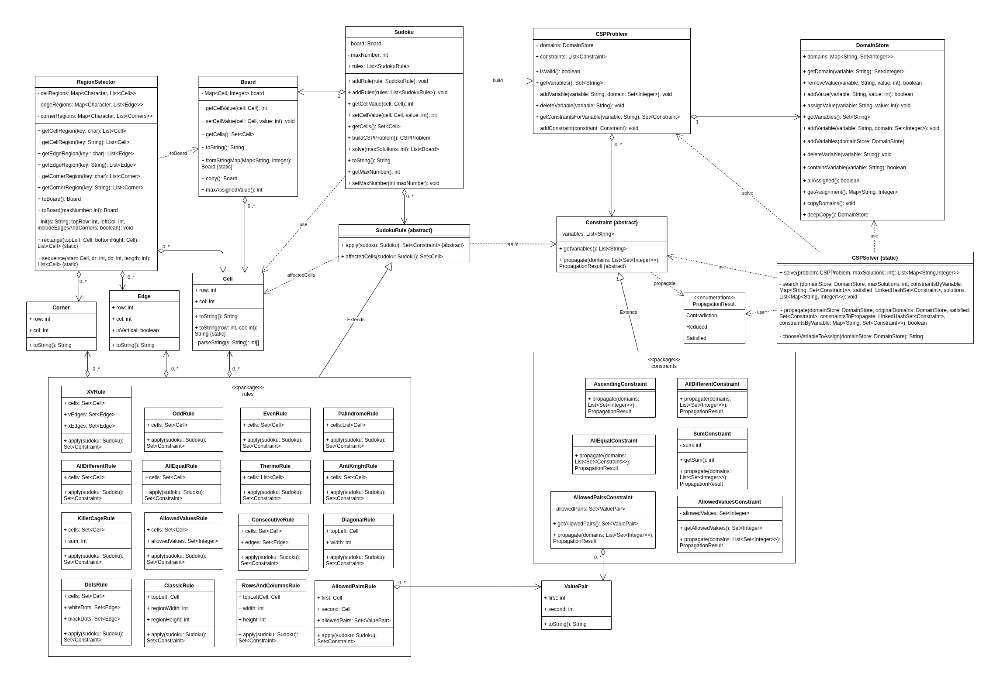

# Sudoku Variant Solver 🧩

A flexible and extensible Java-based programmatic interface designed to model, configure, and solve classic Sudoku puzzles alongside their complex, non-standard custom variants.

The core framework achieves this by translating high-level Sudoku grid representations and rules into a formal **Constraint Satisfaction Problem (CSP)**. By strictly decoupling the puzzle domain from the mathematical solver, implementing new custom variants requires zero modifications to the underlying search and propagation algorithms.

## 📌 Key Features

* **Generic CSP Engine:** A domain-agnostic solver utilizing backtracking search augmented with customizable inference and constraint propagation.
* **Advanced Sudoku Modeling:** A convenient sudoku setup allowing for defining the board (including using ASCII-art strings) and assigning rules to specific cells, edges, or corners.
* **Architecture for Extensibility (Open-Closed Principle):** By extending abstract structural foundations (`SudokuRule` for the puzzle domain and `Constraint` for the CSP engine), developers can easily create custom variations.

## 🛠️ Tech Stack

* **Language:** Java 
* **Build System:** Maven
* **Testing Framework:** JUnit 6 + AssertJ
* **Documentation:** Javadoc

## ⚙️ Build & Execution

This project leverages standard Maven commands. Run the following commands from the root directory to build, test, and document the project:

### 1. Compile
```bash
mvn compile
```
### 2. Run Unit/Integration Tests
```bash
mvn test
```

### 3. Generate documentation
```bash
mvn site
```
**Note on Documentation:**
The complete project documentation is automatically built into the `/docs` directory at the project root:
* **Project Website & Overview:** Open `docs/index.html` in any web browser to view the full site.
* **Code documentation (JavaDocs):** Open `docs/apidocs/index.html` directly to browse the technical code documentation.

## 💡 Quick Start (Usage Example)
Configuring custom grid layouts and rule compositions has been streamlined for maximum developer experience. The snippet below demonstrates how to initialize and solve a diagonal Sudoku puzzle:


```Java
import sudokusolver.sudoku.*;
import sudokusolver.sudoku.rules.*;
import java.util.List;

public class Main {
    public static void main(String[] args) {
        // 1. Define the board using an intuitive ASCII-art string representation
        String sudokuText = """
                4.....76.
                .....7.43
                ...8.....
                6.....9..
                .17...83.
                ..8.....2
                .....3...
                83.5.....
                .72.....6
                """;

        // 2. Create a Sudoku object and add rules
        Sudoku sudoku = new Sudoku(sudokuText);
        sudoku.addRule(new ClassicRule(3, 3));
        sudoku.addRule(new DiagonalRule(9));

        // 3. Solve and display results
        List<Board> solutions = sudoku.solve();
        
        if (solutions.isEmpty()) {
            System.out.println("No solutions.");
        } else if (solutions.size() == 1) {
            System.out.println("Single solution:");
            System.out.println(solutions.get(0));
        } else {
            System.out.println("There are at least 2 solutions:");
            for (Board solution : solutions) {
                System.out.println();
                System.out.println(solution);
            }
        }
    }
}
```

## 📐 Class Structure (UML diagram)


